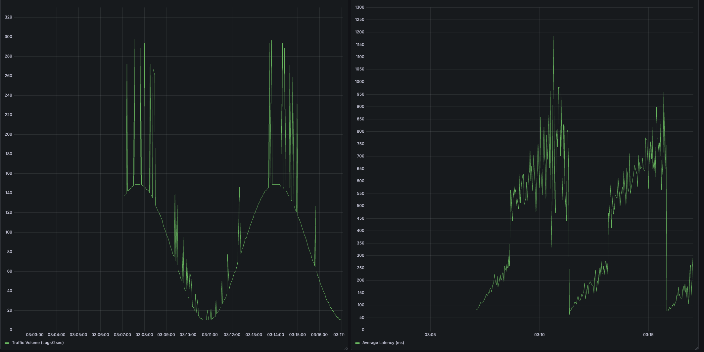
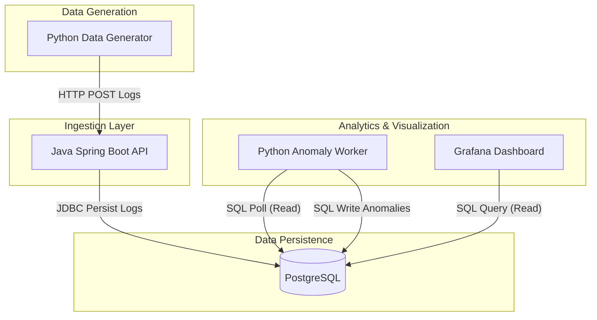

# Distributed Telemetry & Anomaly Detection Engine



A high-performance, containerized telemetry ingestion and real-time anomaly detection pipeline designed to simulate and analyze stateful traffic patterns at scale.

## Architecture Overview

The system is built on a distributed microservices architecture, leveraging custom bridge networking for secure inter-service communication and DNS resolution.



## The Tech Stack

*   **Ingestion API:** Java 21 & Spring Boot (High-concurrency REST layer)
*   **Analytics & Generation:** Python 3.11 (Pandas-driven worker and stateful traffic generator)
*   **Database:** PostgreSQL 16
*   **Visualization:** Grafana
*   **Orchestration:** Docker Compose (Multi-stage builds, custom bridge networks)

## System Behaviors & Engineering Highlights

*   **Custom Bridge Networking & Env Injection:** The entire stack operates within a dedicated Docker bridge network (`telemetry-net`). Service discovery is handled natively via DNS container names, with dynamic environment variable injection overriding default configurations (e.g., Spring Boot JDBC URLs).
*   **Handling Startup Race Conditions (Self-Healing):** Components are designed to be fault-tolerant during initialization. The data generator and anomaly worker gracefully handle connection refused errors, employing backoff strategies to await the full readiness of the database and ingestion API.
*   **Cold Start Mitigation:** The Python anomaly worker implements cold-start awareness, gracefully handling initial empty datasets and building sufficient statistical baselines (e.g., standard deviations for Z-score calculation) before emitting actionable alerts.
*   **Cascading Failure Simulation & Auto-Restarts:** The data generator explicitly simulates sine-wave traffic spikes and eventual database back-pressure. The dashboard reflects these cascading failures in real-time, demonstrating the resilience of the ingestion tier and the robustness of the system architecture.
*   **Automated Incident Alerting:** We configured Grafana Alerting rules tied to our SQL queries. If the PostgreSQL database latency exceeds the 1000ms threshold during the simulated load cascade, it automatically registers a critical incident state, demonstrating proactive observability rather than just passive monitoring.
*   **Real-Time Webhook Notifications (Proactive SRE):** We upgraded the Python Anomaly Worker to act as an intelligent observability engine. When it detects a cascading failure state (e.g., database latency spiking and causing checkout service errors), it bypasses passive dashboards and immediately pushes a formatted 🚨 CRITICAL ANOMALY payload to a Discord Webhook, alerting on-call engineers via push notification on their mobile devices.

## Quick Start Guide

Spin up the entire distributed environment locally:

```bash
docker compose up -d --build
```

**Access the Visualization Layer:**
Navigate to [http://localhost:3000](http://localhost:3000)
*   **Username:** `admin`
*   **Password:** `admin`
